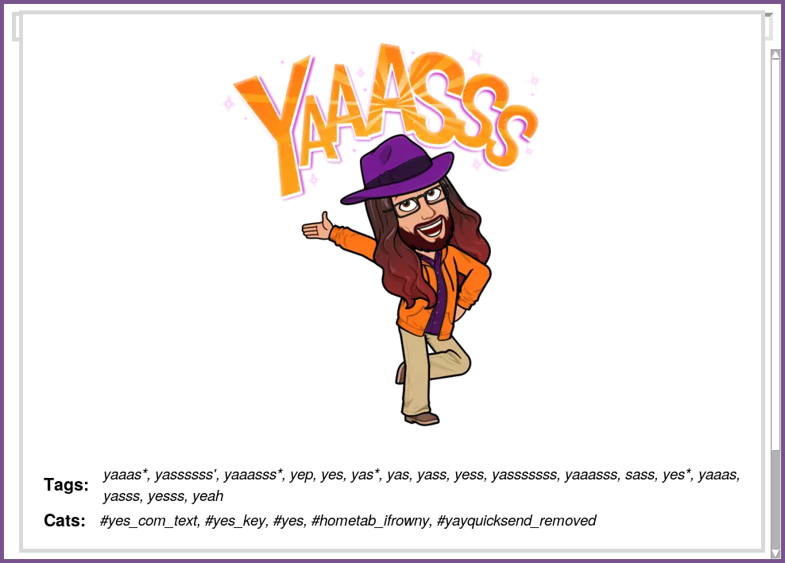

# Bitmoji Sticker Selector

Use Bitmoji stickers (www.bitmoji.com) on Linux with Telegram!

All stickers are downloaded and available localy.

(You are not depend on www.bitmoji.com after resources was downaloded) 


*Main window*


*Search*


*Profiles*


*After you press right mouse button on sticker and holding it*



*After you press left mouse button*


*After you pressed __Send__*


Images are loading on scroll.

When you press Esc the search field will be clear or application will be exit if field is clean.

## DEPENDENCIES (Ubuntu)
```
sudo apt-get install python3-pip python3-tk python3-pil python3-pil.imagetk
sudo apt-get install curl webp imagemagick zip
sudo apt-get install xclip xvkbd
pip3 install --user Pillow
```

## USAGE
1. Register and create avatar with bitmoji app for [android](https://play.google.com/store/apps/details?id=com.bitstrips.imoji) / [apple](https://apps.apple.com/ru/app/bitmoji/id868077558)

2. Get id by executing  ```$ ./get_id```
3. Get resorces by executing  ```$ ./get_res $ID``` (it takes about 10 minutes)
4. Change params *COLS, ROWS, X, Y* in bitmoji wrapper script and test it
5. Add hotkey in keyboard settings to bitmoji script
6. ...
7. **PROFIT!!!**

## THANKS
Bitmoji for stickers.
https://github.com/JoshCheek/bitmoji for information.


